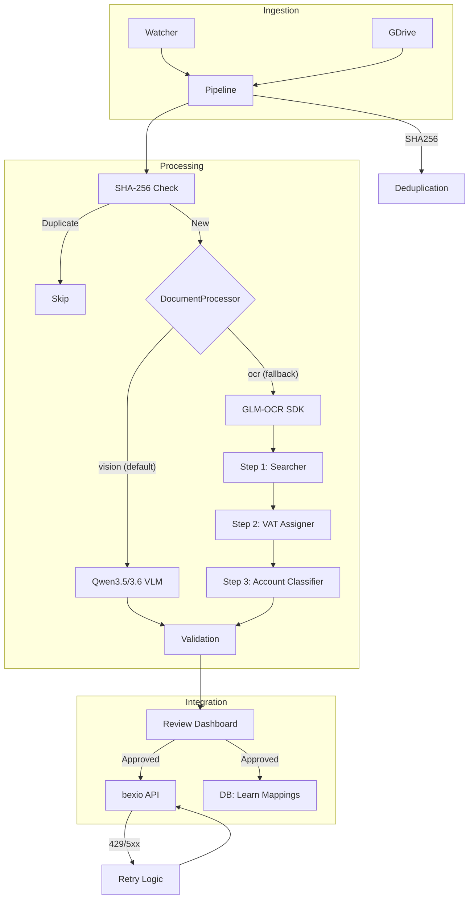

# bexio-receipts 🧾🚀

[](https://github.com/tazztone/bexio-receipts/actions/workflows/ci.yml)
[](https://www.python.org/downloads/)
[](LICENSE)
[](https://github.com/tazztone/bexio-receipts/actions)
[](https://github.com/astral-sh/ruff)

An automated pipeline to ingest, OCR, and extract data from receipts directly into bexio through a mandatory human review process.

---

## 🚀 Quick Start

Get up and running in minutes with the interactive setup wizard:

```bash
uv run bexio-receipts init --quickstart
```

The `--quickstart` flag will:
1.  **Validate** your Bexio token and display your company name.
2.  **Configure** default local models (Qwen 3.5/3.6 & GLM-OCR SDK).
3.  **Process** a bundled demo receipt to verify your local LLM/OCR stack.

### What you'll see first
1.  **Interactive Setup:** Run `init` to connect your Bexio account.
2.  **System Health:** Start the dashboard (`serve`) and visit `/setup` to
    ensure your hardware is ready.
3.  **First Ingestion:** Drop a receipt in `inbox/` or upload it to your
    configured Google Drive folder.
4.  **Review Queue:** Visit the dashboard to triage, correct, and approve your
    receipts.

---

## ✨ Features

- **Consolidated Ingestion:**
  - **Folder Watcher:** Monitors a local directory for new files.
  - **Google Drive:** Polls a specific Drive folder for new receipts.
- **Intelligent Parsing & OCR:**
  - **PDF Extraction:** Uses native text extraction (`pdfplumber`) for 100%
    accuracy on digital PDFs.
  - **GLM-OCR:** A specialized multimodal LLM for high-accuracy text/table
    recognition on scanned images.
- **Intelligent Extraction:** Uses **Pydantic AI** with local VLMs (e.g., Qwen
  3.5/3.6) to parse text into structured data.
- **Swiss Business Rules & Account Classification:**
  - **VAT Verification**: Built-in validation for Swiss VAT rates (8.1%, 2.6%,
    3.8%) and 5-rappen rounding.
  - **Step 3 Classification**: Uses full OCR context to automatically assign
    booking accounts (e.g., 4200 vs 4201) per VAT rate.
  - **Learning Loop**: Remembers per-VAT-rate account choices for each merchant,
    automating future entries with high precision.
- **bexio Integration:** Automatic file upload and expense creation via the
  bexio API.
- **Review Dashboard:** A premium web-based interface (FastAPI + HTMX) to
  manually correct and approve all receipts before they are booked.

---

## 🏗️ Architecture


*See [docs/ARCHITECTURE.md](docs/ARCHITECTURE.md) for a deep dive.*

---

## ⚙️ Setup

### Prerequisites

- [uv](https://github.com/astral-sh/uv) installed.
- [Ollama](https://ollama.com/) (for extraction LLM).
- [vLLM](https://github.com/vllm-project/vllm) or SGLang (for GLM-OCR SDK backend).
- A [bexio Personal Access Token](https://docs.bexio.com/#section/Authentication).

### Installation

```bash
git clone https://github.com/tazztone/bexio-receipts.git && cd bexio-receipts
uv sync

# Copy example environment
cp .env.example .env

# Interactive Setup (Recommended)
uv run bexio-receipts init

# Pull extraction model
ollama pull qwen3.5:9b
```

---

## 🚀 Usage

### CLI

**Interactive Setup:**
```bash
uv run bexio-receipts init
```

**Process a single receipt:**
```bash
uv run bexio-receipts process path/to/receipt.png
```

**Run a dry-run (OCR and extraction only):**
```bash
uv run bexio-receipts process path/to/receipt.png --dry-run
```

**Watchers:**
```bash
uv run bexio-receipts watch folder --path ./my-inbox
uv run bexio-receipts watch gdrive
```

**Manage Managed vLLM Server:**
```bash
# Stop the background vLLM server and free VRAM
uv run bexio-receipts vllm-stop
```

### Review Dashboard

Start the web interface to manage your receipts:
```bash
uv run bexio-receipts serve
```

The dashboard includes:
- **Receipt Thumbnails**: Quick visual identification in the queue.
- **Date Column**: Sort and track receipts by transaction date.
- **Bulk Actions**: Discard multiple invalid receipts at once.
- **OCR Confidence**: See how confident the system was in its extraction.
- **Zoomable Previews**: Click any receipt to see the full-size image.

---

## 🏗️ Project Structure

```text
.
├── src/bexio_receipts/
│   ├── document_processor.py # Vision/OCR strategy orchestrator
│   ├── ocr.py           # Legacy OCR layer (GLM-OCR)
│   ├── extraction.py    # LLM structured extraction (Pydantic AI)
│   ├── prompts.py       # VLM/LLM system prompt templates
│   ├── validation.py    # Swiss VAT & business rules
│   ├── server.py        # Dashboard backend (FastAPI + HTMX)
│   ├── bexio_client.py  # bexio API interactions (httpx)
│   ├── pipeline.py      # Core ingestion logic
│   ├── database.py      # SQLite & deduplication
│   ├── watcher.py       # Folder filesystem monitoring
│   ├── gdrive_ingest.py # Google Drive polling
│   ├── config.py        # Pydantic Settings
│   └── models.py        # Unified data models (Receipt, VisionExtraction)
├── docs/                # Extended documentation
├── tests/               # Pytest suite
│   └── eval/            # Vision evaluation suite (Golden dataset)
└── Dockerfile           # Optimized multi-stage build
```

---

## 📜 License

Distributed under the **MIT License**. See `LICENSE` for more information.

---

### Extended Documentation
- [Architecture](docs/ARCHITECTURE.md): System flow and engine details.
- [VLM Performance](docs/VLM_PERFORMANCE.md): Hardware benchmarks and optimization tips.
- [Configuration](docs/CONFIGURATION.md): Detailed environment variable reference.
- [Development](docs/DEVELOPMENT.md): Setup and contribution guide.
- [Operations](docs/OPERATIONS.md): Production setup and maintenance.
- [Troubleshooting](docs/TROUBLESHOOTING.md): Common issues and fixes.
- [API Reference](docs/API.md): Dashboard endpoints and monitoring.
