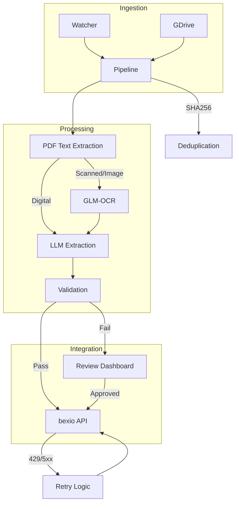

# bexio-receipts 🧾🚀

[](https://github.com/tazztone/bexio-receipts/actions/workflows/ci.yml)
[](https://www.python.org/downloads/)
[](LICENSE)
[](https://github.com/tazztone/bexio-receipts/actions)
[](https://github.com/astral-sh/ruff)

An automated pipeline to ingest, OCR, and extract data from receipts directly into bexio.

---

## 🚀 Quick Start

Get up and running in minutes with the interactive setup wizard:

```bash
uv run bexio-receipts init --quickstart
```

The `--quickstart` flag will:
1.  **Validate** your Bexio token and display your company name.
2.  **Configure** default local models (Qwen 3.5 & GLM-OCR).
3.  **Process** a bundled demo receipt to verify your local LLM/OCR stack immediately.

### What you'll see first
1.  **Interactive Setup:** Run `init` to connect your Bexio account.
2.  **System Health:** Start the dashboard (`serve`) and visit `/setup` to ensure your hardware is ready.
3.  **First Ingestion:** Drop a receipt in `inbox/` or upload it to your configured Google Drive folder.
4.  **Review Queue:** Visit the dashboard to triage any receipts with low confidence or validation errors.

---

## 📖 Table of Contents
- [Features](#-features)
- [Architecture](#-architecture)
- [Setup](#-setup)
- [Usage](#-usage)
- [Ingestion Sources](#-ingestion-sources)
- [Operations Guide](docs/OPERATIONS.md)
- [Troubleshooting](docs/TROUBLESHOOTING.md)
- [Development](docs/DEVELOPMENT.md)
- [License](#-license)

---

## ✨ Features

- **Consolidated Ingestion:**
  - **Folder Watcher:** Monitors a local directory for new files.
  - **Google Drive:** Polls a specific Drive folder for new receipts.
- **Intelligent Parsing & OCR:**
  - **PDF Extraction:** Uses native text extraction (`pdfplumber`) for 100% accuracy on digital PDFs.
  - **GLM-OCR:** A specialized multimodal LLM for high-accuracy text/table recognition on scanned images.
- **Intelligent Extraction:** Uses **Pydantic AI** with local LLMs (e.g., Qwen 3.5) to parse text into structured data.
- **Swiss Business Rules:** Built-in validation for Swiss VAT rates (8.1%, 2.6%, 3.8%), 5-rappen rounding, and native support for multi-rate `vat_breakdown` arrays.
- **bexio Integration:** Automatic file upload and expense creation via the bexio API.
- **Offline Development Mode:** Fully test the UI and LLM pipeline locally without a valid Bexio Personal Access Token.
- **Review Dashboard:** A premium web-based interface (FastAPI + HTMX) to manually correct and approve receipts that fail validation.

---

## 🏗️ Architecture


*See [docs/ARCHITECTURE.md](docs/ARCHITECTURE.md) for a deep dive.*

---

## ⚙️ Setup

### Prerequisites

- [uv](https://github.com/astral-sh/uv) installed.
- [Ollama](https://ollama.com/) (for GLM-OCR and local LLM extraction).
- A [bexio Personal Access Token](https://docs.bexio.com/#section/Authentication).

### Installation

```bash
git clone https://github.com/tazztone/bexio-receipts.git && cd bexio-receipts
uv sync

# Copy example environment
cp .env.example .env

# Interactive Setup (Recommended)
uv run bexio-receipts init

ollama pull glm-ocr        # for OCR
ollama pull qwen3.5:9b     # for extraction

# OpenRouter (Optional)
# 1. Get API Key at openrouter.ai
# 2. Recommended: Enable "Response Healing" at openrouter.ai/settings/plugins
```

---

## 🚀 Usage

### CLI

The CLI is powered by [Typer](https://typer.tiangolo.com/) and provides grouped commands.

**Interactive Setup:**
```bash
uv run bexio-receipts init
```

**Process a single receipt:**
```bash
uv run bexio-receipts process path/to/receipt.png
```

**Run a dry-run (OCR and extraction only):**
```bash
uv run bexio-receipts process path/to/receipt.png --dry-run
```

**Watchers:**
```bash
uv run bexio-receipts watch folder --path ./my-inbox
uv run bexio-receipts watch gdrive
```

**Mappings:**
```bash
uv run bexio-receipts mapping export mappings.json
uv run bexio-receipts mapping import mappings.json
```

### Review Dashboard

Start the web interface to manage files that fail validation:
```bash
uv run bexio-receipts serve
```

The dashboard includes:
- **Receipt Thumbnails**: Quick visual identification in the queue.
- **Date Column**: Sort and track receipts by transaction date.
- **Bulk Actions**: Discard multiple invalid receipts at once.
- **OCR Confidence**: See how confident the system was in its extraction.
- **Zoomable Previews**: Click any receipt to see the full-size image.

---

## 📥 Ingestion Sources

### Folder Watcher
Simply drop files into the configured `INBOX_PATH` (default: `./inbox`).

### Google Drive
- **Service Account (Recommended):** Share your Drive folder with the SA email.
- **User Account (OAuth2):** Run `uv run bexio-receipts gdrive-auth` to generate `token.json`.

---

## 🛠️ Troubleshooting

- **Ollama Connection Error:** Ensure Ollama is running (`ollama serve`) and `OLLAMA_HOST` is correctly set.
- **bexio 401 Unauthorized:** Verify your `BEXIO_API_TOKEN` hasn't expired and has the correct permissions.
- **OpenRouter Validation Errors:** Ensure you have enabled "Response Healing" in your OpenRouter account settings to fix minor JSON formatting issues.
- **Missing Poppler:** Ensure `poppler-utils` is installed for scanned PDF support.

---

## 🏗️ Project Structure

```text
.
├── src/bexio_receipts/
│   ├── ocr.py           # Unified OCR layer (GLM-OCR)
│   ├── extraction.py    # LLM structured extraction (Pydantic AI)
│   ├── validation.py    # Swiss VAT & business rules
│   ├── server.py        # Dashboard backend (FastAPI + HTMX)
│   ├── bexio_client.py  # bexio API interactions (httpx)
│   ├── pipeline.py      # Core ingestion logic
│   ├── database.py      # SQLite & deduplication
│   ├── watcher.py       # Folder filesystem monitoring
│   ├── gdrive_ingest.py # Google Drive polling
│   ├── config.py        # Pydantic Settings
│   └── models.py        # Pydantic data models
├── docs/                # Extended documentation
├── tests/               # Pytest suite
└── Dockerfile           # Optimized multi-stage build
```

- **[docs/ARCHITECTURE.md](docs/ARCHITECTURE.md)**: System flow and engine details.
- [docs/CONFIGURATION.md](docs/CONFIGURATION.md): Detailed env var reference.
- [docs/DEVELOPMENT.md](docs/DEVELOPMENT.md): Development setup and best practices.
- [docs/OPERATIONS.md](docs/OPERATIONS.md): Production setup and maintenance tasks.
- [CHANGELOG.md](CHANGELOG.md): History of changes.

---

## 📜 License

Distributed under the **MIT License**. See `LICENSE` for more information.
