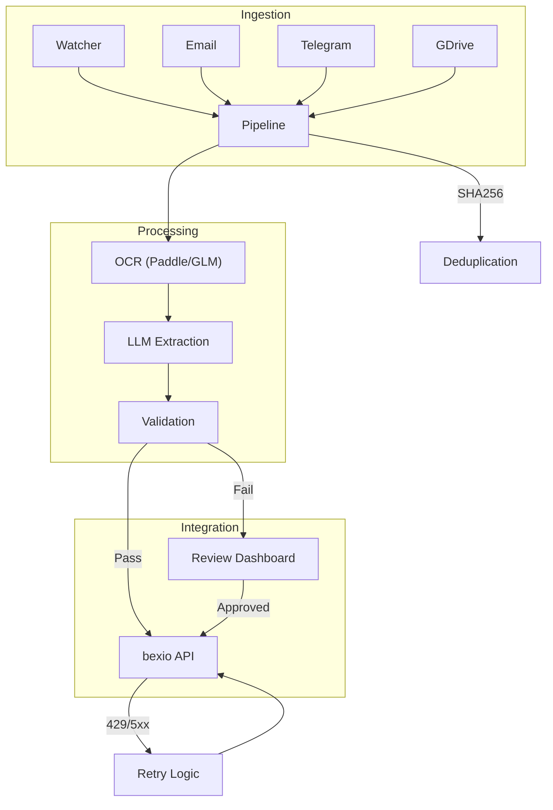

# bexio-receipts 🧾🚀

[](https://github.com/tazztone/bexio-receipts/actions/workflows/ci.yml)
[](https://www.python.org/downloads/)
[](LICENSE)
[](https://github.com/tazztone/bexio-receipts/actions)
[](https://github.com/astral-sh/ruff)

An automated pipeline to ingest, OCR, and extract data from receipts directly into bexio.

---

## ⚡ Quick Start

### Docker (Recommended)
```bash
# Clone and start everything
git clone https://github.com/tazztone/bexio-receipts.git && cd bexio-receipts
uv run bexio-receipts init  # Follow the prompts to set up your .env
docker compose up -d
```

### Local (uv)
```bash
uv sync
uv run bexio-receipts init  # Interactive setup wizard
uv run bexio-receipts process path/to/receipt.png --dry-run
```

---

## 📖 Table of Contents
- [Features](#-features)
- [Architecture](#-architecture)
- [Setup](#-setup)
- [Usage](#-usage)
- [Ingestion Sources](#-ingestion-sources)
- [Troubleshooting](#-troubleshooting)
- [Development](#-development)
- [License](#-license)

---

## ✨ Features

- **Multi-Source Ingestion:**
  - **Folder Watcher:** Monitors a local directory for new files.
  - **Email (IMAP):** Automatically downloads attachments from an inbox.
  - **Telegram Bot:** Send photos or PDFs directly to the bot for processing.
  - **Google Drive:** Polls a specific Drive folder for new receipts.
- **Multi-Engine OCR:**
  - **PaddleOCR (Default):** High-performance PP-OCRv5 with orientation and unwarping support.
  - **GLM-OCR:** A lightweight (0.9B) multimodal LLM for high-accuracy text and table recognition (via Ollama).
- **Intelligent Extraction:** Uses **Pydantic AI** with local LLMs (e.g., Qwen2.5) to parse OCR text into structured data.
- **Swiss Business Rules:** Built-in validation for Swiss VAT rates (8.1%, 2.6%, 3.8%) and 5-rappen rounding tolerance.
- **bexio Integration:** Automatic file upload and expense creation via the bexio API (v3/v4).
- **Review Dashboard:** A web-based interface (FastAPI + HTMX) to manually correct and approve receipts that fail validation.

---

## 🏗️ Architecture


*See [docs/ARCHITECTURE.md](docs/ARCHITECTURE.md) for a deep dive.*

---

## ⚙️ Setup

### Prerequisites

- [uv](https://github.com/astral-sh/uv) installed.
- [Ollama](https://ollama.com/) (if using GLM-OCR or local LLM extraction).
- A [bexio Personal Access Token](https://docs.bexio.com/#section/Authentication).

### Installation

```bash
git clone https://github.com/tazztone/bexio-receipts.git && cd bexio-receipts
uv sync

# Interactive Setup (Recommended)
uv run bexio-receipts init

# Or manually pull Ollama models
ollama pull glm-ocr        # for OCR
ollama pull qwen3.5:9b     # for extraction
```

### Docker

The project includes an optimized multi-stage `Dockerfile`.

```bash
docker compose up -d
```
The dashboard will be available at `http://localhost:8000`.

---

## 🚀 Usage

### CLI

The CLI is powered by [Typer](https://typer.tiangolo.com/) and provides grouped commands.

**Interactive Setup:**
```bash
uv run bexio-receipts init
```

**Process a single receipt:**
```bash
uv run bexio-receipts process path/to/receipt.png
```

**Run a dry-run (OCR and extraction only):**
```bash
uv run bexio-receipts process path/to/receipt.png --dry-run
```

**Watchers:**
```bash
uv run bexio-receipts watch folder --path ./my-inbox
uv run bexio-receipts watch telegram
uv run bexio-receipts watch email
uv run bexio-receipts watch gdrive
```

**Mappings:**
```bash
uv run bexio-receipts mapping export mappings.json
uv run bexio-receipts mapping import mappings.json
```

### Review Dashboard

Start the web interface to manage files that fail validation:
```bash
uv run bexio-receipts serve
```

The new dashboard includes:
- **Receipt Thumbnails**: Quick visual identification in the queue.
- **Date Column**: Sort and track receipts by transaction date.
- **Bulk Actions**: Discard multiple invalid receipts at once.
- **OCR Confidence**: See how confident the system was in its extraction.
- **Zoomable Previews**: Click any receipt to see the full-size image.

---

## 📥 Ingestion Sources

### Google Drive Setup
- **Service Account (Recommended):** Share your Drive folder with the SA email.
- **User Account (OAuth2):** Run `uv run bexio-receipts gdrive-auth` to generate `token.json`.

---

## 🛠️ Troubleshooting

- **Ollama Connection Error:** Ensure Ollama is running (`ollama serve`) and `OLLAMA_HOST` is correctly set.
- **PaddleOCR Installation Failures:** On Linux, ensure `libpoppler-cpp-dev` is installed. On macOS, use `brew install poppler`.
- **bexio 401 Unauthorized:** Verify your `BEXIO_API_TOKEN` hasn't expired and has the correct permissions.
- **Docker Port Conflicts:** If port 8000 is taken, change the mapping in `docker-compose.yml`.

---

## 🏗️ Project Structure

```text
.
├── src/bexio_receipts/
│   ├── ocr.py           # Unified OCR layer
│   ├── extraction.py    # LLM structured extraction
│   ├── validation.py    # Swiss VAT & business rules
│   ├── server.py        # Dashboard backend
│   └── bexio_client.py   # API interactions
├── docs/                # Extended documentation
├── tests/               # Pytest suite
└── Dockerfile           # Optimized multi-stage build
```

- **[docs/index.md](docs/index.md)**: Main documentation portal.
- [docs/ARCHITECTURE.md](docs/ARCHITECTURE.md): System flow and engine details.
- [docs/CONFIGURATION.md](docs/CONFIGURATION.md): Detailed env var reference.
- [CHANGELOG.md](CHANGELOG.md): History of changes.

---

## 🚧 Known Limitations

- **Hardware**: local extraction with `qwen3.5:9b` via Ollama requires at least 16GB RAM and is significantly faster with a CUDA-compatible GPU.
- **Language**: PaddleOCR (default) is optimized for Latin-based languages. Handwritten or non-Latin receipts may require `glm-ocr`.
- **Merchant Match**: Automatic contact creation in bexio relies on high-confidence merchant name extraction.

---

## 🔗 Useful Links
- [bexio API Documentation](https://docs.bexio.com/)
- [GLM-OCR](https://github.com/zai-org/GLM-OCR)
- [PaddleOCR](https://github.com/PaddlePaddle/PaddleOCR)

---

## 📜 License

Distributed under the **MIT License**. See `LICENSE` for more information.
