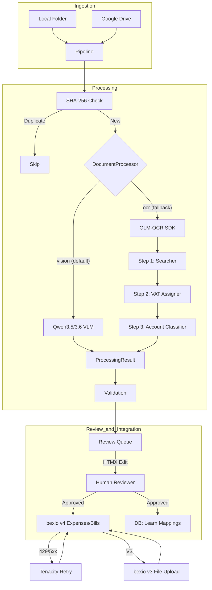

# System Architecture

## Overview
bexio-receipts is a modular pipeline for automated bookkeeping. It takes raw
files from various sources and turns them into verified bexio entries through a
mandatory human review process. This "Human-in-the-loop" (HIL) policy applies to
all ingestion paths, including local folders and Google Drive.

## Data Flow

## Core Components

### 1. Ingestion Layer
- **Watcher**: Uses `watchdog` to monitor filesystem events.
- **GDrive**: Uses Google Drive API (v3) to poll and move files.

### 2. Document Processing Layer (`document_processor.py`)
- **Strategy Pattern**: The pipeline supports multiple extraction strategies,
  selectable via `processor_mode` ("vision" or "ocr").
- **Vision Strategy (Default)**: Uses high-performance Vision-Language Models
  (VLMs) such as **Qwen3.5-9B** or **Qwen3.6-27B** served via vLLM. It performs
  single-pass extraction of all receipt fields directly from images or PDF text.
  The system supports multi-language prompt templates (German, English, and
  French) and uses type-safe schema generation from `models.py` to prevent
  prompt drift.
- **OCR Strategy (Fallback)**: Uses the **GLM-OCR SDK** for layout analysis and
  text extraction, followed by a multi-step LLM pipeline for data structuring.
- **Native PDF Support**: Digital PDFs have text extracted via `pymupdf` and sent
  as text input, avoiding lossy image conversion.

### 3. vLLM Inference Backend (`vllm_server.py`)
Both strategies utilize a local **vLLM** inference engine. The application
provides unified lifecycle management to start and stop the server based on the
active strategy and hardware constraints. It supports various quantization formats,
including **AWQ** and **GGUF**, and is optimized for consumer GPUs like the
RTX 3090/4090.

### 4. Extraction Layer (`extraction.py`)
- **Pydantic AI**: Orchestrates the three-step LLM pipeline:
  - **Step 1 (Searcher)**: Transcribes basic receipt data (merchant, date, total)
    and locates the raw VAT table.
  - **Step 2 (VAT Assigner)**: Parses the raw VAT snippet into structured rows
    using deterministic math validation to prevent hallucinations.
  - **Step 3 (Account Classifier)**: Assigns Swiss booking accounts based on the
    full OCR context (product items) and VAT rates.
- **Model Intelligence**: Enforces strict schemas using `Receipt`,
  `VisionExtraction`, and `AccountAssignment` models (all residing in
  `models.py`). Handles merchant identification, date/currency parsing, and
  Swiss VAT rate detection.
- **Contract**: The `Receipt` model uses an alias for the transaction date.
  While the internal field is `transaction_date`, the JSON source must provide
  the key `date`.

### 4. Database Layer (`database.py`)
A SQLite-backed persistence layer that handles:
- **Deduplication**: Every file is hashed. If the hash exists in
  `processed_receipts.db`, it is skipped to prevent double bookings.
- **Merchant Mapping**: Remembers the last used booking account (or specific
  per-VAT-rate mapping) for each merchant to automate future entries.
- **Concurrency**: Implements proper connection pooling and transaction
  management for both the pipeline and the dashboard.

### 5. bexio Integration (`bexio_client.py`)
A custom async client (using `httpx`) that:
- **API v3**: Used for file uploads (Bexio's file storage).
- **API v4**: Used for creating Expenses and Purchase Bills (modern endpoints
  with better supplier tracking).
- **Retry Logic**: All API calls are wrapped in a `@BEXIO_RETRY` decorator
  (using `tenacity`) to handle rate limits and transient network issues.

### 6. Review Dashboard (`server.py`)
- **FastAPI**: Provides the backend and API logic.
- **HTMX**: Enables a dynamic, "single-page" feel for manually reviewing,
  correcting, and pushing receipts. All receipts flow through this dashboard to
  ensure 100% accuracy before booking.

### 7. Validation Logic (`validation.py`)
Strict business rules for the Swiss market:
- VAT rate verification (8.1%, 2.6%, 3.8% and historical 7.7%, 2.5%).
- Total/Subtotal cross-checks with 5-rappen Swiss rounding tolerance.
- Future/Old date warnings.
