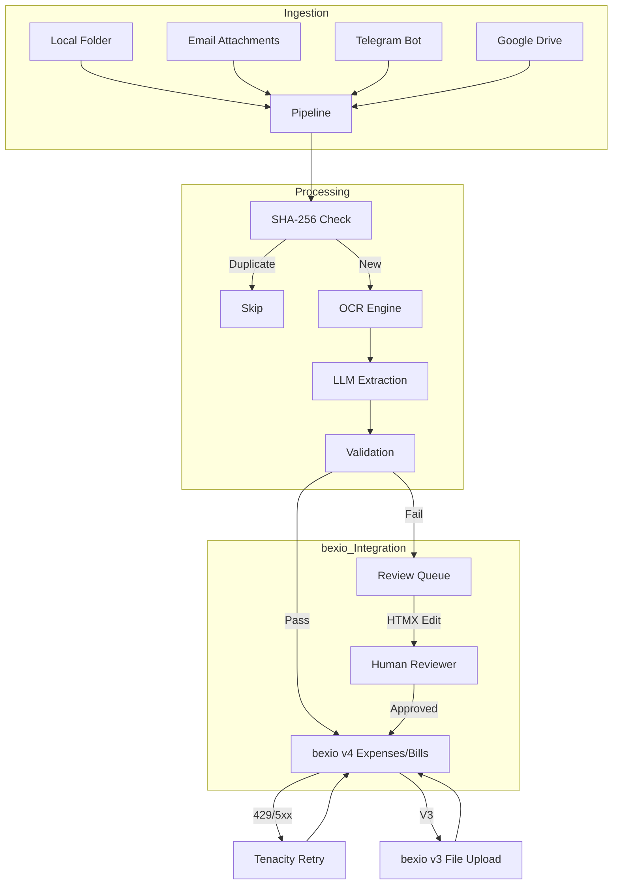

# System Architecture

## Overview
`bexio-receipts` is a modular pipeline for automated bookkeeping. It takes raw files from various sources and turns them into verified bexio entries.

## Data Flow



## Core Components

### 1. Ingestion Layer
- **Watcher**: Uses `watchdog` to monitor filesystem events.
- **Email**: Uses `aioimaplib` for async IMAP polling. Refrains from marking emails as read until attachments are successfully saved.
- **Telegram**: Uses `python-telegram-bot` to handle incoming photos and documents.
- **GDrive**: Uses Google Drive API (v3) to poll and move files.

### 2. OCR Layer (`ocr.py`)
- **PaddleOCR**: Local engine, fast and robust for standard Latin text.
- **GLM-OCR**: Multimodal LLM (via Ollama) for more complex layouts or handwritten notes.
- **Resilience**: The GLM-OCR path is designed to be tolerant of markdown-wrapped JSON output. The pipeline automatically strips markdown code fences (e.g., ` ```json `) before parsing the extracted data.

### 3. Extraction Layer (`extraction.py`)
- **Pydantic AI**: Orchestrates the LLM prompt. It enforces a strict schema using the `Receipt` model. The core system prompt is located within `src/bexio_receipts/extraction.py`.
- **Model Intelligence**: Extracts structured data into Pydantic models. This layer handles merchant identification, date/currency parsing, and Swiss VAT rate detection.
- **Contract**: Note that the `Receipt` model uses an alias for the transaction date. While the internal field is `transaction_date`, the JSON source must provide the key `date`.

### 4. Database Layer (`database.py`)
A SQLite-backed persistence layer that handles:
- **Deduplication**: Every file is hashed. If the hash exists in `processed_receipts.db`, it is skipped to prevent double bookings.
- **Merchant Mapping**: Remembers the last used booking account for each merchant to automate future entries.
- **Concurrency**: Implements proper connection pooling and transaction management for both the pipeline and the dashboard.

### 5. bexio Integration (`bexio_client.py`)
A custom async client (using `httpx`) that:
- **API v3**: Used for file uploads (Bexio's file storage).
- **API v4**: Used for creating Expenses and Purchase Bills (modern endpoints with better supplier tracking).
- **Retry Logic**: All API calls are wrapped in a `@BEXIO_RETRY` decorator (using `tenacity`) to handle rate limits and transient network issues.

### 6. Review Dashboard (`server.py`)
- **FastAPI**: Provides the backend and API logic.
- **HTMX**: Enables a dynamic, "single-page" feel for manually reviewing, correcting, and pushing receipts that failed automated validation without full page reloads.

### 7. Validation Logic (`validation.py`)
Strict business rules for the Swiss market:
- VAT rate verification (8.1%, 2.6%, 3.8%).
- Total/Subtotal cross-checks with 5-rappen Swiss rounding tolerance.
- Future/Old date warnings.
