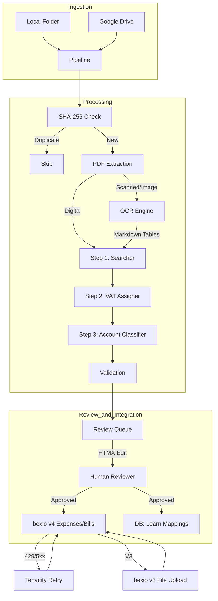

# System Architecture

## Overview
bexio-receipts is a modular pipeline for automated bookkeeping. It takes raw
files from various sources and turns them into verified bexio entries through a
mandatory human review process.

## Data Flow

## Core Components

### 1. Ingestion Layer
- **Watcher**: Uses `watchdog` to monitor filesystem events.
- **GDrive**: Uses Google Drive API (v3) to poll and move files.

### 2. Text Extraction Layer (`ocr.py`)
- **PDF Extraction**: Native text extraction via `pdfplumber`. Provides 100%
  fidelity for digital PDFs and entirely skips the vision models.
- **GLM-OCR**: Specialized multimodal model (via Ollama) built on the GLM-V
  architecture. It is the sole OCR engine, triggered using the canonical
  `"Text Recognition:"` prompt to activate its internal layout analysis
  pipeline (**PP-DocLayout-V3**).
- **Two-Step Extraction**: The OCR path uses a decoupled workflow: (1) GLM-OCR
  transcribes the receipt into raw text/Markdown, (2) Qwen extracts structured
  JSON. This prevents the Vision model from hallucinating math to fit a JSON
  schema.
- **Image Optimization**: All images are capped at **2560px** (LANCZOS) and
  converted to **WebP (q90)** before being sent to the vision model. WebP
  preserves text sharpness better than JPEG while keeping payloads small.
- **PDF Scans**: Scanned PDFs are converted to images at **300 DPI** to ensure
  fine-text legibility for complex VAT summaries.

### 3. Extraction Layer (`extraction.py`)
- **Pydantic AI**: Orchestrates the three-step LLM pipeline:
  - **Step 1 (Searcher)**: Transcribes basic receipt data (merchant, date, total)
    and locates the raw VAT table.
  - **Step 2 (VAT Assigner)**: Parses the raw VAT snippet into structured rows
    using deterministic math validation to prevent hallucinations.
  - **Step 3 (Account Classifier)**: Assigns Swiss booking accounts based on the
    full OCR context (product items) and VAT rates.
- **Model Intelligence**: Enforces strict schemas using `Receipt` and
  `AccountAssignment` models. Handles merchant identification, date/currency
  parsing, and Swiss VAT rate detection.
- **Contract**: The `Receipt` model uses an alias for the transaction date.
  While the internal field is `transaction_date`, the JSON source must provide
  the key `date`.

### 4. Database Layer (`database.py`)
A SQLite-backed persistence layer that handles:
- **Deduplication**: Every file is hashed. If the hash exists in
  `processed_receipts.db`, it is skipped to prevent double bookings.
- **Merchant Mapping**: Remembers the last used booking account (or specific
  per-VAT-rate mapping) for each merchant to automate future entries.
- **Concurrency**: Implements proper connection pooling and transaction
  management for both the pipeline and the dashboard.

### 5. bexio Integration (`bexio_client.py`)
A custom async client (using `httpx`) that:
- **API v3**: Used for file uploads (Bexio's file storage).
- **API v4**: Used for creating Expenses and Purchase Bills (modern endpoints
  with better supplier tracking).
- **Retry Logic**: All API calls are wrapped in a `@BEXIO_RETRY` decorator
  (using `tenacity`) to handle rate limits and transient network issues.

### 6. Review Dashboard (`server.py`)
- **FastAPI**: Provides the backend and API logic.
- **HTMX**: Enables a dynamic, "single-page" feel for manually reviewing,
  correcting, and pushing receipts. All receipts flow through this dashboard to
  ensure 100% accuracy before booking.

### 7. Validation Logic (`validation.py`)
Strict business rules for the Swiss market:
- VAT rate verification (8.1%, 2.6%, 3.8%).
- Total/Subtotal cross-checks with 5-rappen Swiss rounding tolerance.
- Future/Old date warnings.
