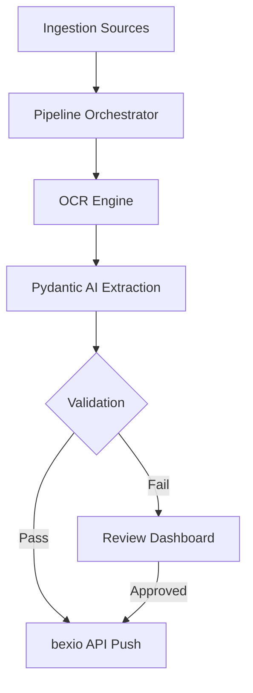

# Project Architecture

`bexio-receipts` is an automated pipeline designed to bridge the gap between physical/digital receipts and bexio's accounting system.

## High-Level Flow

### 1. Ingestion Sources
The system supports multiple entry points for receipts:
- **Folder Watcher**: Monitors a local directory (usually `./inbox`).
- **Email (IMAP)**: Polling an inbox for PDF/Image attachments.
- **Telegram Bot**: Direct upload via the Telegram platform.
- **Google Drive**: Continuous polling of a shared folder.

### 2. OCR Layer (`ocr.py`)
Multiple engines are supported:
- **PaddleOCR (Local)**: The default engine using PP-OCRv5 for high-performance offline recognition.
- **GLM-OCR (Ollama)**: A lightweight multimodal LLM alternative.

### 3. Extraction (`extraction.py`)
Uses the **Pydantic AI** framework to transform raw OCR text into structured Pydantic models (`Receipt`). This layer handles:
- Merchant identification.
- Date and Currency parsing.
- VAT rate detection (Swiss-specific).
- Automatic retries on hallucinated or invalid schemas.

### 4. Logic & Validation (`validation.py`)
Strict business rules for the Swiss market:
- VAT rate verification (8.1%, 2.6%, 3.8%).
- Total/Subtotal cross-checks with 5-rappen Swiss rounding tolerance.
- Future/Old date warnings.

### 5. bexio Integration (`bexio_client.py`)
A custom async client (using `httpx`) that:
- Maps merchants to booking accounts (caching the mapping in SQLite).
- Handles file uploads to bexio's storage.
- Creates **Expenses** (v4 API) or **Purchase Bills** (v3 API) depending on the certainty of merchant identification.
- Includes automatic retries for transient API failures.

### 6. Review Dashboard (`server.py`)
A FastAPI server with an HTMX-powered UI for manually reviewing, correcting, and pushing receipts that failed automated validation.
